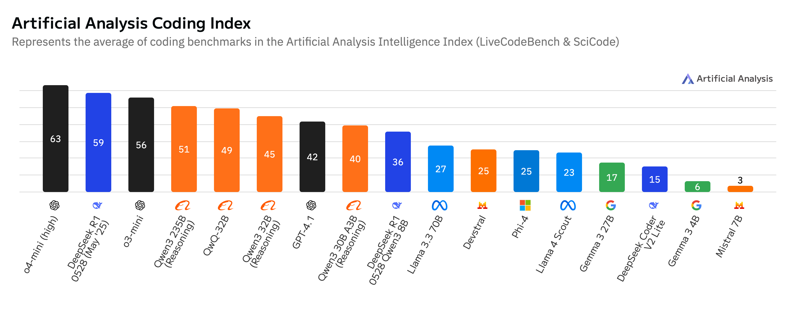

# Artificial Analysis Intelligence Index (20250606)

## Choose the right model for you! (preferred for ollama self-hosting)

### Source: https://artificialanalysis.ai/

* We test many LLMs and make a recommendation here:

### Reasoning Model vs Non-Reasoning Model

### Open Weights vs Proprietary

